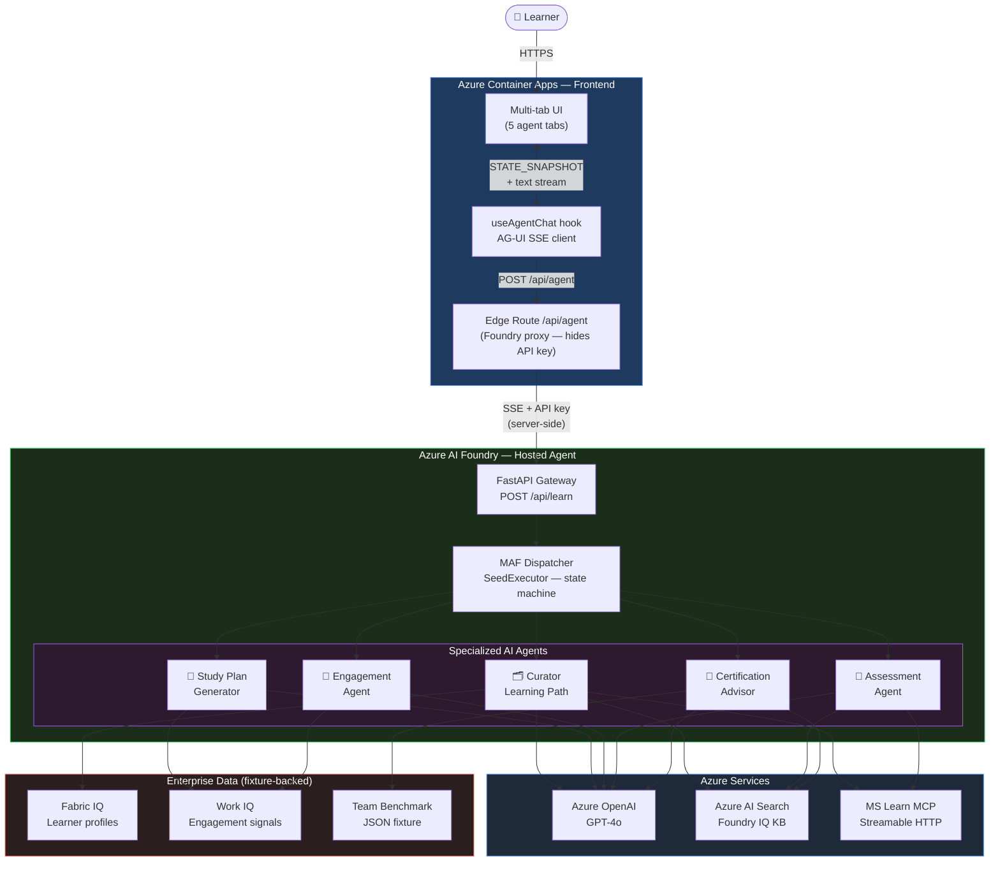

# Architecture Diagram — Enterprise Learning System

High-level view of the system: actors, layers, agents, and Azure services.

> **Live Demo:** https://enterprise-learning-frontend.mangosmoke-abb8c649.northcentralus.azurecontainerapps.io

---

## Live Deployment

| Component | Platform | URL |
|---|---|---|
| **Frontend** | Azure Container Apps | https://enterprise-learning-frontend.mangosmoke-abb8c649.northcentralus.azurecontainerapps.io |
| **Backend** | Azure AI Foundry Hosted Agent | `foundry-ns-yersy.services.ai.azure.com` (invocations protocol) |

---

## Layer Summary

| Layer | Platform | What it does |
|---|---|---|
| **Next.js 15 Frontend** | Azure Container Apps | Renders the 5-tab agentic UI; `useAgentChat` hook handles SSE event parsing and `WorkflowState` hydration |
| **Edge Route `/api/agent`** | ACA (Edge Runtime) | Proxies SSE stream to Foundry — keeps API key server-side, never exposed to browser |
| **FastAPI Gateway** | Azure AI Foundry | Receives AG-UI `POST /api/learn`, opens SSE stream, delegates to MAF |
| **MAF Dispatcher** | Azure AI Foundry | Routes each message to the correct `Executor` based on `WorkflowState.workflow_status` |
| **Specialized Agents** | Azure AI Foundry | Each agent owns one phase; runs as a Foundry-hosted agent with its own tools and system prompt |
| **Azure OpenAI (GPT-4o)** | Azure OpenAI | Reasoning core for all 5 agents |
| **Azure AI Search** | Azure AI Search | Foundry IQ KB — enterprise knowledge base in agentic mode (answer synthesis + citations) |
| **MS Learn MCP** | External | Official Microsoft documentation grounding for Curator and Assessment agents |
| **Fabric IQ** | Fixture-backed | Learner profile data (role, seniority, skill gaps, completed certs) |
| **Work IQ** | Fixture-backed | Engagement signals (focus peak, channel preferences, availability, streak data) |
| **Team Benchmark** | Fixture-backed | Pre-computed JSON fixture with team score distributions and domain averages per cert |
