# Multi-Agent Workflow — Enterprise Learning System

This document describes the end-to-end workflow of the system: how agents activate, how state transitions, and how the frontend reflects each step in real time over AG-UI/SSE.

---

## Sequence Diagram

```mermaid
sequenceDiagram
    actor Learner
    participant UI as Next.js Frontend<br/>(AG-UI SSE client)
    participant GW as FastAPI Gateway<br/>(AG-UI endpoint)
    participant MAF as MAF Dispatcher<br/>(SeedExecutor)
    participant CUR as Curator Agent<br/>(CuratorExecutor)
    participant KB as Foundry IQ KB<br/>(Azure AI Search MCP)
    participant MSL as MS Learn MCP
    participant SPL as Study Plan Agent<br/>(StudyPlanExecutor)
    participant WIQ as Work IQ
    participant ENG as Engagement Agent<br/>(EngagementExecutor)
    participant HITL as HITL Gate
    participant ASS as Assessment Agent<br/>(AssessmentExecutor)
    participant ADV as Advisor Agent<br/>(CertificationAdvisorExecutor)

    %% ── PHASE 0: SESSION BOOT ──────────────────────────────────────────────
    Learner->>UI: Select topics + click "Start learning session"
    UI->>GW: POST /api/learn {WorkflowState, message: "Start my learning path..."}
    GW->>MAF: RunAgent(WorkflowState)
    MAF->>MAF: SeedExecutor detects status=planning
    MAF-->>UI: STATE_SNAPSHOT (workflow_status: "planning", current_agent: "curator")
    Note over UI: Tab 1 — Curator Agent activates

    %% ── PHASE 1: CURATOR RUN 1 — CERT RECOMMENDATION ──────────────────────
    MAF->>CUR: LearnerMessage → CuratorExecutor.handle()
    CUR->>KB: search_knowledge_base(learner skills + goals)
    KB-->>CUR: grounded cert context + references
    Note over CUR: KB query captured → kb_activity in state
    CUR->>CUR: Reason over profile + KB → rank cert options
    CUR-->>MAF: cert_options[] + recommendation scores
    MAF-->>UI: STATE_SNAPSHOT (workflow_status: "awaiting_cert_selection", cert_options)
    Note over UI: Foundry IQ panel visible in chat<br/>Cert cards rendered for selection

    %% ── HITL GATE 1: LEARNER SELECTS CERT ─────────────────────────────────
    Learner->>UI: Click certification card (e.g. AI-102)
    UI->>GW: POST /api/learn {selected_cert_id: "AI-102", message: "..."}
    MAF->>MAF: SeedExecutor detects status=awaiting_cert_selection
    MAF-->>UI: STATE_SNAPSHOT (selected_cert_id: "AI-102")

    %% ── PHASE 2: CURATOR RUN 2 — PATH CURATION ─────────────────────────────
    MAF->>CUR: CertSelectedMessage → handle_cert_selected()
    CUR->>MSL: search_learning_paths("AI-102")
    MSL-->>CUR: official learning paths + modules
    CUR->>MSL: get_module_details(module_ids[])
    MSL-->>CUR: module content, hours, prerequisites
    CUR->>KB: search_knowledge_base("AI-102 domain priorities")
    KB-->>CUR: domain weights + enterprise context
    CUR->>CUR: Build CurationResult — prioritize by exam weight<br/>Mark necessary_learn per learner strengths
    CUR-->>MAF: CurationResult (learning_path, priority_domains, coverage_summary)
    MAF-->>UI: STATE_SNAPSHOT (workflow_status: "awaiting_path_confirmation", learning_path)
    Note over UI: Learning path cards rendered<br/>Necessary vs optional modules flagged

    %% ── HITL GATE 2: LEARNER CONFIRMS PATH ─────────────────────────────────
    Learner->>UI: "Build my intelligent study plan"
    UI->>GW: POST /api/learn {message: "Build my intelligent study plan"}
    MAF->>MAF: SeedExecutor detects status=awaiting_path_confirmation → PathConfirmedMessage

    %% ── PHASE 3: STUDY PLAN ─────────────────────────────────────────────────
    MAF->>SPL: PathConfirmedMessage → StudyPlanExecutor
    Note over UI: Tab 2 — Study Plan Agent activates
    SPL->>WIQ: get_learner_schedule_preferences(employee_id)
    WIQ-->>SPL: preferred_days, session_duration, focus_peak, weekly_capacity
    SPL->>SPL: compute_study_schedule() — deterministic Python scheduler<br/>Allocates sessions across weeks, respects capacity
    SPL->>SPL: LLM writes study_plan_reasoning narrative only
    SPL-->>MAF: study_plan[], study_milestones[], study_plan_reasoning
    MAF-->>UI: STATE_SNAPSHOT (workflow_status: "awaiting_engagement", study_plan)
    Note over UI: Timeline calendar rendered<br/>Milestones shown per domain

    %% ── PHASE 4: ENGAGEMENT PLANNING ────────────────────────────────────────
    Learner->>UI: "Proceed with engagement planning"
    MAF->>MAF: SeedExecutor → EngagementConfirmedMessage
    Note over UI: Tab 3 — Engagement Agent activates
    MAF->>ENG: EngagementConfirmedMessage → EngagementExecutor
    ENG->>WIQ: get_engagement_profile(employee_id)
    WIQ-->>ENG: focusPeak, meetingWindow, responseRateByChannel, avgStreakDays
    ENG->>WIQ: get_study_availability(employee_id)
    WIQ-->>ENG: schedule availability context
    ENG->>ENG: Apply decision rules → compute channel, timing, trigger<br/>LLM authors previewText + reasoning per alert
    ENG->>ENG: submit_engagement_proposal(4 alerts validated)
    ENG-->>MAF: EngagementProposal (4 alerts: reminder, milestone, motivation, risk)
    MAF-->>UI: STATE_SNAPSHOT (workflow_status: "awaiting_assessment", engagement_proposal)
    Note over UI: Engagement proposal card<br/>Learner confirms or adjusts

    %% ── HITL GATE 3: ENGAGEMENT CONFIRMED → ASSESSMENT UNLOCKS ─────────────
    Learner->>UI: "Confirm engagement plan"
    UI->>GW: POST /api/learn {message: "Assessment confirmed..."}
    MAF->>MAF: SeedExecutor detects status=awaiting_assessment → HITLConfirmedMessage
    Note over UI: Tab 4 — Assessment Agent activates

    %% ── PHASE 5: ASSESSMENT GENERATION ──────────────────────────────────────
    MAF->>ASS: HITLConfirmedMessage → AssessmentExecutor
    ASS->>ASS: Compute domain allocation (largest-remainder algorithm)<br/>e.g. AI-102 → {Plan&Manage: 4, NLP: 3, Vision: 3, ...}
    ASS->>MSL: MS Learn MCP — fetch AI-102 official content
    MSL-->>ASS: module documentation + examples
    ASS->>KB: search_knowledge_base("AI-102 learner history EMP-003")
    KB-->>ASS: learner performance history + exam QA data
    Note over ASS: KB activity captured → chat panel
    ASS->>ASS: Generate 15 questions with bloom_level, difficulty,<br/>is_scenario_based, correct_answers, grounding_reference
    ASS->>ASS: Validate against AssessmentQuestion[] schema<br/>(corrective retry with cert+learner context if needed)
    ASS-->>MAF: assessment_questions[] (public projection — no correct_answers)
    MAF-->>UI: STATE_SNAPSHOT (workflow_status: "exam_in_progress", assessment_questions)
    Note over UI: 15-question exam interface renders

    %% ── PHASE 6: EXAM + SCORING ──────────────────────────────────────────────
    Learner->>UI: Answer 15 questions + Submit
    UI->>GW: POST /api/learn {assessment_answers, workflow_status: "exam_in_progress"}
    MAF->>MAF: SeedExecutor detects answers → AssessmentAnswersMessage
    MAF->>ASS: AssessmentExecutor grades answers (server-side, correct_answers injected)
    ASS->>ASS: Score per question (partial credit for multi_select)<br/>Compute domain_scores, weak_areas, overall_score
    ASS-->>MAF: AssessmentResult (score, passed, domain_scores, per_question_results)
    MAF-->>UI: STATE_SNAPSHOT (assessment_results, workflow_status)

    alt score ≥ 70% (PASS)
        MAF-->>UI: workflow_status: "passed"
        Note over UI: Assessment results → PASS badge
    else score < 70% AND retry_count < max_retries (FAIL → RETRY)
        MAF-->>UI: workflow_status: "exam_failed"
        Note over UI: Retry Assessment button shown
        Learner->>UI: "Retry Assessment"
        MAF->>MAF: retry_count++, workflow_status = "assessing"
        MAF->>ASS: Re-generate 15 questions (new attempt)
        Note over MAF: Back to Assessment Generation phase
    else score < 70% AND no retries left (MAX_RETRIES)
        MAF-->>UI: workflow_status: "max_retries_reached"
    end

    %% ── PHASE 7: ADVISOR ──────────────────────────────────────────────────────
    Note over UI: Tab 5 — Advisor Agent auto-activates
    MAF->>ADV: AssessmentPassedMessage → CertificationAdvisorExecutor
    ADV->>ADV: Precompute: performance_snapshot, domain_table,<br/>Bloom error distribution, has_scenario_gap per domain
    ADV->>ADV: get_team_benchmark("AI-102") → percentile_rank(score, distribution)
    ADV->>KB: Query team qualitative insights for AI-102<br/>(instructor feedback, domain pain points)
    KB-->>ADV: Qualitative context for closing_note + resource_hint
    ADV->>ADV: LLM generates AdvisorResult JSON<br/>(scenario tone: celebratory if passed, constructive if max_retries)
    ADV->>ADV: Validate AdvisorResult schema<br/>(corrective retry → deterministic fallback)
    ADV->>ADV: _scrub_result() — PII redaction on all free-text fields
    ADV-->>MAF: advisor_result (dict), advisor_result_raw (str)
    MAF-->>UI: STATE_SNAPSHOT (advisor_result, workflow_status: passed | max_retries_reached)
    Note over UI: AdvisorView renders:<br/>Score ring · Percentile bar · Domain analysis<br/>Strong areas · Review areas · Recommendations<br/>Closing note · "Finalize track" CTA

    Learner->>UI: "Finalize track"
    UI->>UI: setScreen("dashboard")
    Note over UI: Session complete — dashboard shown
```



---

## State Machine

```
                     ┌─────────┐
                     │planning │  ◄── initial state (new session)
                     └────┬────┘
                          │ CuratorExecutor (Run 1)
                          ▼
              ┌──────────────────────┐
              │ awaiting_cert_       │  ◄── learner picks from cert options
              │ selection            │
              └──────────┬───────────┘
                         │ CuratorExecutor (Run 2)
                         ▼
              ┌──────────────────────┐
              │ awaiting_path_       │  ◄── learner reviews + confirms path
              │ confirmation         │
              └──────────┬───────────┘
                         │ StudyPlanExecutor
                         ▼
                   ┌──────────┐
                   │ studying │
                   └────┬─────┘
                        │ EngagementExecutor
                        ▼
              ┌──────────────────────┐
              │ awaiting_engagement  │  ◄── learner confirms engagement plan
              └──────────┬───────────┘
                         │ (engagement confirmed)
                         ▼
                  ┌───────────┐
                  │ assessing │  ◄── AssessmentExecutor generating questions
                  └─────┬─────┘
                        │ questions ready
                        ▼
              ┌───────────────────┐
              │  exam_in_progress │  ◄── learner answering 15 questions
              └─────────┬─────────┘
                        │
          ┌─────────────┼──────────────────┐
          │             │                  │
          ▼             ▼                  ▼
      ┌────────┐  ┌────────────┐  ┌──────────────────────┐
      │ passed │  │ exam_failed│  │ max_retries_reached  │
      └────┬───┘  └─────┬──────┘  └──────────┬───────────┘
           │            │                     │
           │     retry_count < max_retries    │
           │            │                     │
           │            ▼                     │
           │      ┌───────────┐               │
           │      │ assessing │ ─────────────►│
           │      └───────────┘  (retry loop) │
           │                                  │
           └──────────────┬───────────────────┘
                          │ AssessmentPassedMessage
                          ▼
                 ┌──────────────────┐
                 │ AdvisorExecutor  │  (both PASS and MAX_RETRIES route here)
                 └──────────────────┘
                          │
                          ▼
                   ┌────────────┐
                   │  complete  │  → "Finalize track" → dashboard
                   └────────────┘
```

---

## AG-UI Event Flow

The frontend receives a stream of typed events from the backend during each agent run:

| Event | When emitted | Frontend effect |
|---|---|---|
| `STATE_SNAPSHOT` | After every significant state change | Tabs unlock, content renders, agent label updates |
| `TEXT_MESSAGE_START` | Agent begins streaming a text response | New chat bubble appears (streaming) |
| `TEXT_MESSAGE_CONTENT` | Each token arrives | Chat bubble content updates live |
| `TEXT_MESSAGE_END` | Agent finishes streaming | Bubble finalized, KB panel attached if present |
| `TOOL_CALL_START` | Agent calls a tool | Tool indicator shown in UI |
| `TOOL_CALL_END` | Tool returns result | Indicator removed |
| `RUN_FINISHED` | Executor completes | `isRunning = false`, controls re-enable |
| `RUN_ERROR` | Unhandled exception | Error message shown |

The `STATE_SNAPSHOT` is the key event — it carries the full `WorkflowState` serialized as JSON. The frontend derives all derived state (exam questions, assessment results, advisor result, active tab, unlock conditions) from this snapshot.

---

## Key Data Flows

### KB Grounding Observability
```
AgentExecutor.handle()
  │
  ├── _KBCaptureMiddleware attached to agent.run()
  │   └── intercepts tool call to KB MCP
  │       ├── captures: query text
  │       ├── captures: response text (synthesized answer)
  │       └── captures: source references (title, URL, score)
  │
  └── After agent.run():
      state.kb_activity = KBActivity(query, response_text, references)
      │
      └── STATE_SNAPSHOT → frontend
          └── Chat bubble rendered with "Foundry IQ" panel
              (query · synthesized answer · citation links)
```

### Assessment Corrective Retry
```
AssessmentExecutor
  │
  ├── generate_assessment_questions(cert_id, learner_id, middleware=[...])
  │   ├── Attempt 1: agent.run(user_message)
  │   │   └── TypeAdapter(list[AssessmentQuestion]).validate_json(raw)
  │   │       ├── SUCCESS → return validated questions
  │   │       └── FAIL → capture ValidationError as exc_1_str
  │   │
  │   └── Attempt 2: agent.run(_make_corrective_prompt(cert_id, learner_id, exc_1_str))
  │       └── validates again → SUCCESS or raises
  │
  └── On success: state.assessment_questions = [AssessmentQuestionPublic(...)]
                  (correct_answers stripped from public projection)
```

### Advisor Hybrid Reasoning
```
CertificationAdvisorExecutor
  │
  ├── Precompute (Python, no LLM)
  │   ├── _compute_performance_snapshot(questions, results) → perf_snapshot
  │   ├── _compute_domain_table(questions, results) → domain_table
  │   │   └── per domain: accuracy, pattern (conceptual/bloom/scenario gap), has_scenario_gap
  │   ├── get_team_benchmark(cert_id) → bench_avg, bench_distribution, bench_domain_avgs
  │   └── percentile_rank(score, bench_distribution) → team_percentile (int)
  │
  ├── LLM Call with structured context
  │   ├── System prompt: JSON schema + Bloom rules + tone rules + PII prohibition
  │   └── User message: precomputed values + per-question compact table
  │
  ├── Parse + Validate
  │   ├── _parse_advisor_result(raw) → AdvisorResult.model_validate(data)
  │   ├── On failure: corrective retry
  │   └── On double failure: _build_fallback_advisor_result() [deterministic, no LLM]
  │
  └── _scrub_result(result) → PII redaction on all free-text fields
      └── state.advisor_result = result.model_dump()
```
